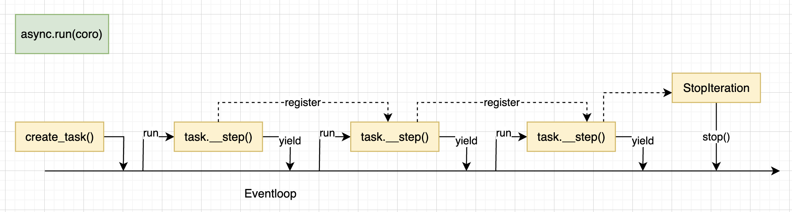

# Tiny-asyncio
Implement asyncio from scatch, in 400 lines of code. Build your own `await`, `sleep`, `gather`, etc. No more magic! Don't miss Q&A section. My favorate learnings. 

This doc is written with the help of ChatGPT. Similarly for the code.

## Usage Recap 
- https://docs.python.org/3/library/asyncio.html
```python
import asyncio

async def main():
    data = await fetch_data()
    res = await process_data(data)
    await save_result(res)

if __name__ == "__main__":
    asyncio.run(main())

```

## Keyword Under the Hood
### async
`async` defines a function as coroutine. Think of as a generator. It can be paused and resumed, allowing for cooperative multitasking. When invoked (e.g. `async def foo(); coro=foo()`), `foo()` doesn't execute but returns a `coroutine` object (or a `async generator`).

### await
`await` pauses the execution of current coroutine, until the awaited coroutine completes. This allows the event loop to run other tasks while waiting, thus achieving concurrency.

Technically it's not equavallent but you can think of `await` as `yield from` in mental model. So, what is `yield from`? 
```python
def foo():
    yield from my_generator()
```
is (largely) equivalent to 
```python
def foo():
    for value in my_generator():
        yield value
```
Or (forget about `send` for now)
```python
def foo():
    it = iter(my_generator())
    while True:
        try:
            value = next(it)
            yield value
        except StopIteration:
            break
```
If you want to know what exactly does python interpretor handles `yield from`, read Fluent Python chatper 16. It has a detailed manual implementation.

Now back to `await`. `await` can only be used on `awaitable`s (anything defines `__await__` can be an `awaitable`). If `await` on a coroutine object, it's equavallent to invokes its underlying generator. e.g. 
```python
async def foo():
    yield 1
    yield 2
    yield 3

async def main():
    await foo()
```
It's like `yield from foo()`, though note that now the caller is `eventloop`, and it's `eventloop` received those values (e.g. 1,2,3). Similarly, it can also `await` on a customized class which implements `__await__`, e.g.
```python
class Future:
    ...
    def __await__(self):
        if not self.done():
            self._asyncio_future_blocking = True
            yield self
        assert self.done(), "Future should be done"
        return self.result()
```
This is the real implementation of `Future`! You may find `self._asyncio_future_blocking = True` part confusing. It's ok for now. But remember, this is the core trick that creates the magic asynchrous-ness of asyncio!

## Major Abstractions
### Eventloop
The event loop continuously runs, monitoring for I/O events, executing scheduled tasks, and invoking callbacks. It ensures non-blocking behavior by allowing other tasks to execute while waiting for I/O operations to complete. Read `Eventloop::_run_once()` as an entry point.

### Future
An awaitable object that represents a pending result. Futures are typically used for coordination between coroutines and can be explicitly awaited to retrieve their results once the underlying operation completes. Most (if not all) of the asynchronous-ness is achieved by `Future.__await__()`!

### Task
Task inherits from `Future`.  A Task is an abstraction that wraps a coroutine, enabling it to be scheduled for execution by the event loop. `asyncio.sleep()` is pretty much all implemented by `Task::__step()`. So cool!

### Handle
A Handle is an abstraction representing a scheduled callback. Think of it as a `callable`. That's it. `TimedHandle` is a bit more interesting!

## Asyncio from Scratch!
### asyncio.run()
1. `asyncio.run(coro)` wraps `coro` into a `Task`, and schedules it onto the `eventloop`. 
2. When one coro `awaits` (or calls) another, think of as normal function invocation, and call stack.
3. When reaches `yield`, pauses the current coroutine, passes the control to `eventloop`. In the meanwhile, creates another `Task` scheduled to `eventloop`, whose `__step()` iterates the coroutine/generator again, by calling `self._coro.send(None)`. Check out `Task.__step()`. 
4. `StopIterator` triggers `Future.set_result(exc.value)`.
5. The very original task has a on_done_callback, which signals to stop `eventloop`.

<p align="left">
    
</p>

### asyncio.sleep()
When the program reaches `await async.sleep(dur)`

1. A `Future` object is created.
2. A time based event is registered, which will be executed after `dur` amount of time. All it does is to call `future.set_result()`.
3. Current coroutine will now `await future`.
4. Check out `Future.__await__()` implementation. Very cool! It no longer registers the next `Task` to `eventbase` immediately like above. Instead, the registration is now the `on_done_callback` of the `future`. This essentially pauses the execution of the coroutine, and only resume after `future` completes, which happens `dur` seconds later.

<p align="left">
    
</p>

### io & select()
High level network libraries, e.g. aiohttp, under the hood.
1. Primitives: 
    1. `async def create_connection(host, port) -> socket`
    2. `async def sock_sendall(sock, data) -> int`
    3. `async def sock_recv(sock) -> bytes`
2. `sock_sendall()` under the hood
    1. Similar to `sleep()`, a `future` is created, and current `coro` will pause and await for the `future`
    2. Meanwhile, register a write `event` to `selector` with the `callback`
    3. The `callback` either updates the `event` to keep sending data, if not fully sent yet; Or, mark `fut.set_result()` and unregister the `event`, if all data sent.
    4. Similar to `sleep()`, `fut.set_result()` further triggers a callback, which resumes the original coroutine (by registering a new task to `eventloop`)
3. `sock_recv()`
    1. Almost the same as `sock_sendall()`, with one difference. Instead of iteratively checking if data fully sent, this checks if data full received, by either checking if delimiter or b`` received.

<p align="left">
    
</p>

### Periodical background task
Cannot be simpler with existing primitives we built
```python
def create_periodical_task(fn: Callable, interval: float):
    def _wrapper():
        loop = get_event_loop()
        loop.call_later(interval, _wrapper)
        fn()
    loop = get_event_loop()
    loop.call_later(interval, _wrapper)
```

### asyncio.gather()
Similar to C++'s `collect()/collectAll()`. The implementation is also almost the same.
```python
async def gather(*coros: Coroutine):
    loop = get_event_loop()
    fut = loop.create_future()
    results = []

    async def wrapper(coro):
        result = await coro
        results.append(result)
        if len(results) == len(coros):
            fut.set_result(results)

    for coro in coros:
        loop.create_task(wrapper(coro))
    return await fut
```


## Q&As - my favorate learnings!
- Q: What happens under the hood when a `coro` gets suspended?
    - Normally, when `eventloop` drives a `coro`, it creates a `task` that wraps the `coro`. Whenever `coro` reaches `yield`, it gives control back to `eventloop`. But, before giving back the control, it re-registers another `task` onto the `eventloop`, which will resume its own execution.
    - To suspend a `coro`, simply skip the `re-register` part. Then it won't resume automatically, withour external interference. In this case, it's usually the awaited thing (e.g. `fut`) will do the `re-register` after certain condition completes (e.g. time reached, io completed).
- Q: What happens under the hood when a `coro` gets resumed?
    - As explained as above, understanding how to resume is now straightforward - simply re-register the coro back to `evenloop`. And next `loop` (i.e. `run_forever()`) will pick it up and resume the execution.
- Q: What is a `Task`? Does each `coro` (or `await coro`) creates a task? 
    - I was pretty much confused by this earlier as a C++ programmer! In C++, e.g. folly library, each continuation/callback creates a new task. 
    - `asyncio` is different! Calling `await coro` itself doesn't create a new `task`. It simply calls into that function (more precisely, the generator) just like calling a normal function. Only when reaches `yield`, it suspects itself, creates another `task` and registers to `eventloop` for resumption.
    - In short, all the `yield`s cut `coro` into `tasks`. Each task is responsible to run logics between two `yield`s.
- Q: How to make a `coro` actually *wait* for something?
    - When a `coro` gets suspended, and no one resumes it, it starts the wait!
    - This is implemented by `Future.__await__()`. It `yield` the control, but doesn't directly register the new `task` onto the `eventloop`. Instead, its `on_done_callback` does the registration. So the original `coro` can only be resumed when the `future` is completed.
    - This is the whole trick of both time based and io based asynchronous-ness implemented
- Q: When a `coro` await on a future, what does `fut.__await__()` actually do?
    - Signal `Task/Eventloop` that don't proceed before `future` completes. Checkout `_asyncio_future_blocking` for details!
- Q: How does `sleep()` work?
    - First, it uses `future` to suspect the current `coro`. 
    - `eventloop` keeps running. And in each iteration, it checks the current time, and picks all the time based events that is ready, and execute them.
    - The completion of those time based events triggers the resumption of original `coro`s.
- Q: How does libraries, e.g. `aiohttp`, yield itself and only resume when network completes?
    - `Future` allows to suspend the `coro`. One more primitive needed is `sock_send/sock_recv`. It registers event to `selector`. When corresponding network tasks complete, the callback fulfills the `future` and resumes the original `coro`.


## Appendix 1 - socket programming
A socket is essentially a data structure that abstracts the complexities of network communication into a manageable interface, providing the necessary attributes (IP address, port number, protocol) and mechanisms (buffers, state management) to enable data transmission between networked applications.
- Ip addr, port, protocol
- File descriptor
- State management: state of the connection, status of the data being sent and received
- Buffers

https://docs.python.org/3/library/socket.html

Major APIs and Usage: checkout `examples/socket_example.py`.
- Q: How does `socket.recv(SIZE)` know whether full data received?
    - It doesn't. It's caller responsibility to check this, by checking if any predefined condition is met, e.g. a delimeter (e.g. `\n`) or `b""` is received.
    - Caller should Repeatedly invoke `recv()` until received the full data.
- Q: How does the caller know if `socket.send(data)` sends out the full data?
    - `send()` returns the size of data sent successfully.
    - It's caller's responsibility to ensure full data is sent, by repeatedly invoke `send()`. 

After the server is bound to an address and port, the server listens for incoming connections.
```bash
# To inspect:
    > netstat -an | grep LISTEN
    > lsof -i -P -n | grep LISTEN
    > nc -zv localhost 10000-20000 2>&1 | grep succeeded
        Connection to localhost port 12345 [tcp/italk] succeeded!
# To connect from terminal:
    > nc localhost 12345
```
## Appendix 2 - non-blocking socket & selector 
When using non-blocking sockets (`sock.setbloacking(False)`), `select`/`selector` is used to check when does the underlying network communication complete.

https://docs.python.org/3/library/selectors.html

### Major APIs:
- `register(sock, event, data)`: data can be arbitrary thing. One handy usage is to set the corresponding callback
- `select(timeout) -> list[(SelectorKey, mask)]`
    - `timeout == 0` means poll and return immediately. `timeout == None` means wait forever until there is an event
    - `class selectors.SelectorKey`
    ```
    A SelectorKey is a namedtuple used to associate a file object to its underlying file descriptor, selected event mask and attached data. It is returned by several BaseSelector methods.

    fileobj: File object registered.
    fd: Underlying file descriptor.
    events: Events that must be waited for on this file object.
    data: Optional opaque data associated to this file object: for example, this could be used to store a per-client session ID.
    ```
- nonblocking socket
    - Abstraction: only read/write is provided, no ordering, nor which event correspond to which read or write
    - It's upto caller/higher level API to handle those semantics. 
    - `select()` only tells, if a `socket`/`fd` is ready for read - so a callback can run `sock.recv()` on it.
    - `select()` only tells, if a `socket`/`fd` is eady for write (i.e. buffer has availables) - so a callback can run `sock.write()` on it
    - Calling `recv()`/`write()` doesn't guaranttes the full data can be received or sent. It's caller's responsibility to repeatedly call `select` and `recv()`/`send()` upon.